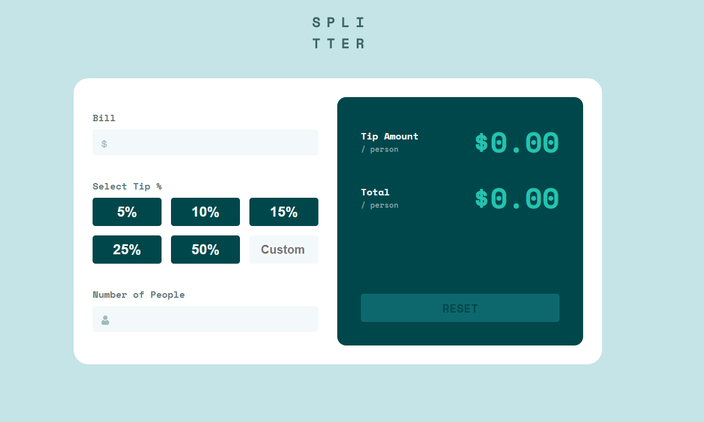
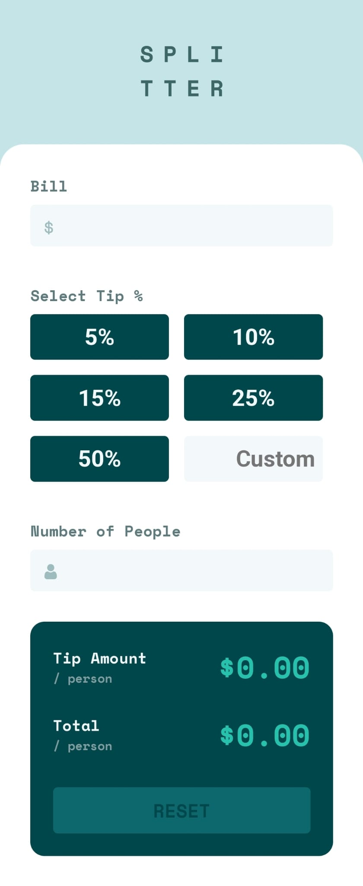

# Frontend Mentor - Tip calculator app solution

This is a solution to the [Tip calculator app challenge on Frontend Mentor](https://www.frontendmentor.io/challenges/tip-calculator-app-ugJNGbJUX). Frontend Mentor challenges help you improve your coding skills by building realistic projects.

## Table of contents

- [Overview](#overview)
  - [The challenge](#the-challenge)
  - [Screenshot](#screenshot)
  - [Links](#links)
- [My process](#my-process)
  - [Built with](#built-with)
  - [What I learned](#what-i-learned)
  - [Continued development](#continued-development)
- [Author](#author)

## Overview

### The challenge

Users should be able to:

- View the optimal layout for the app depending on their device's screen size
- See hover states for all interactive elements on the page
- Calculate the correct tip and total cost of the bill per person

### Screenshot

### Links

- Solution URL: [GitHub](https://github.com/DrakeHermit/tip-calculator-app)
- Live Site URL: [Live Site](https://drakehermit-tip-calculator.netlify.app/)

## My process

1. Write the HTML markup(Later update it as needed)
2. Write the CSS for mobile version
3. Write the CSS for desktop version
4. Write the JS

### Built with

- Semantic HTML5 markup
- CSS custom properties
- Flexbox
- Grid
- Mobile-first workflow

### What I learned

I learned a ton working on this challenge, and I really tested my knowledge with applying either submit or reset state based on the situatio. Is it a perfect solution not by a long shot, but I am actually proud of myself for being able to make it work the way I wanted it to work. I also learned that by writing CSS poorly you will end up with a lot of !important statements, but that is something I am going to keep an eye on in the next challenges I work on. CSS wise even though it's not perfect it looks decently good.

### Continued development

I will continue working on learning JS further there is still quite a lot I want to learn before I move onto React.js. But I will of course put more effort into accessibility and overall CSS code structure. Even though I put a lot of effort in my JS code there are still things I could structure better, but I am 100% sure that with time I will understand all the concepts of clean code.

## Author

- Frontend Mentor - [@DrakeHermit](https://www.frontendmentor.io/profile/DrakeHermit)